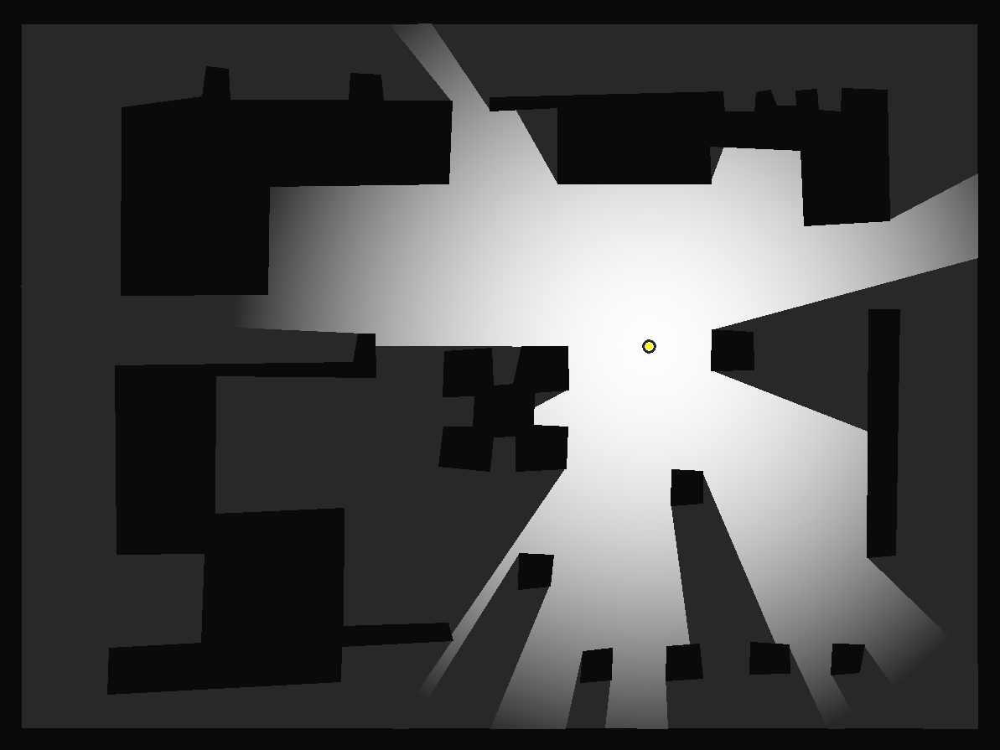
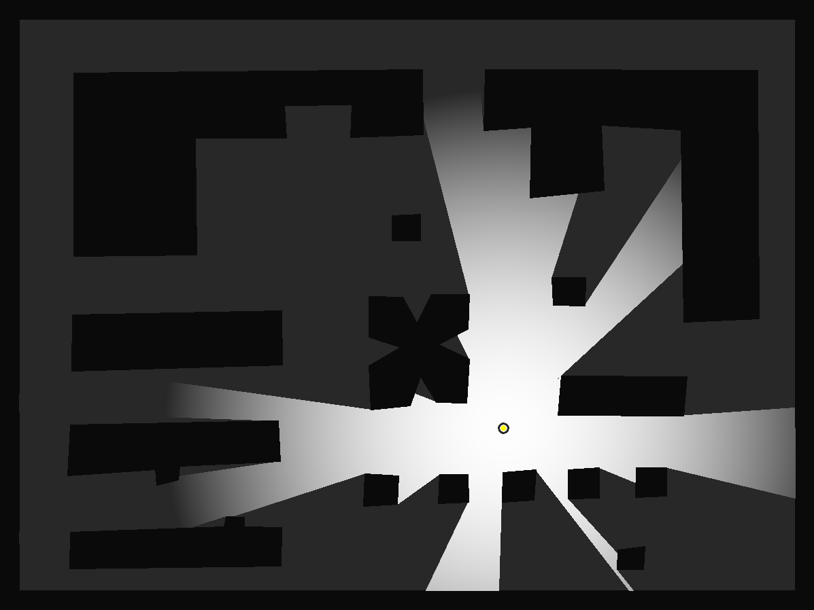
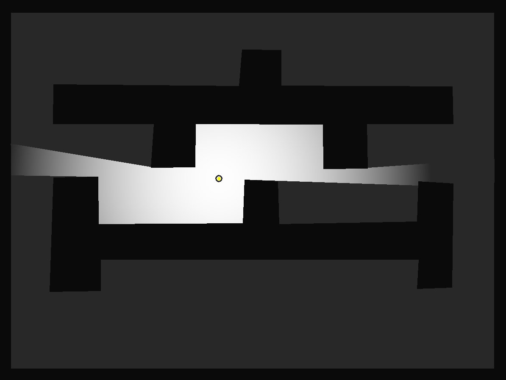
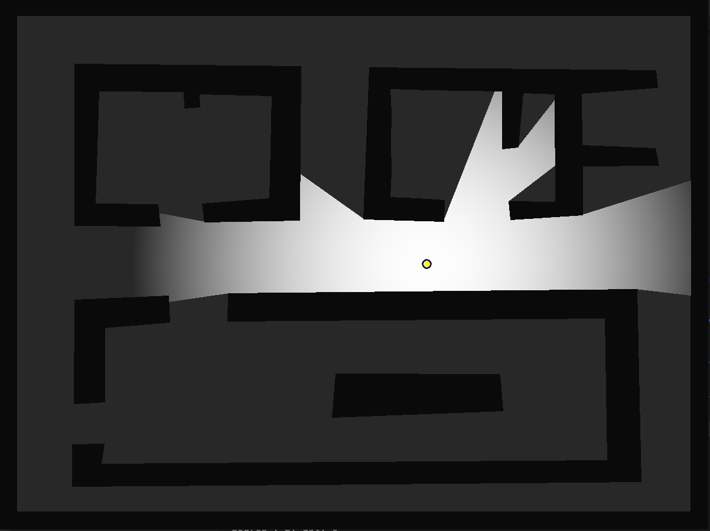
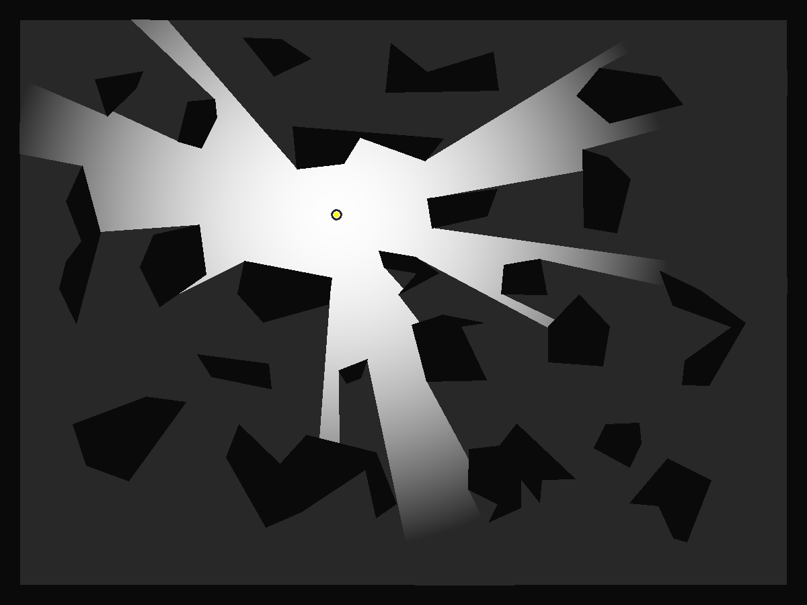
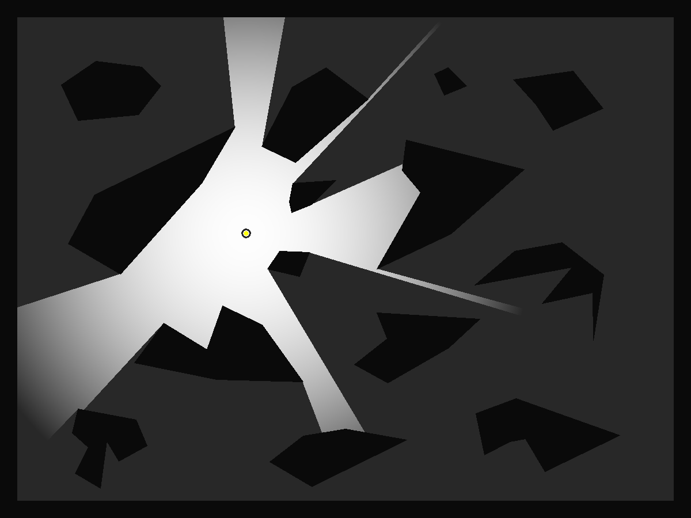

# Volume2D shader

---

## Recent Updates

- 2021.8.26 Major revision in Volume, delete much redundant code. Make the logic clearer and simpler, more efficient.
- Some bugs are fixed, and the new updates are tested in 4 new maps seen as follows.
  - Able to handle the boundaries which cover more than 360 degs.
  - Able to run in a "Room like" (relatively closed) maps.
  - Better occlusion judgement strategies, less code than before.
  - Four new **<u>standard maps</u>** are added in the folder `maps`
  - Mouse control in OpenCV 4, much easier to control your source of light.
  - Notice that if you are looking for a **<u>2D LiDAR simulator</u>**, I have built a simple simulator upon this repository, see [[Enigmatisms/ParticleFilter]](https://github.com/Enigmatisms/ParticleFilter), which is awesome.

|  |  |
| -------------------------------------------------- | -------------------------------------------------- |
|  |  |

---

## I. Introduction

​		This C++ repo is for a 2D real-time “volume light” generator, designed for irregular obstacles. I have implemented the algorithm for regular obstacles (squares) in repo: [[Enigmatisms/Algorithm-Plus]](https://github.com/Enigmatisms/Algorithms-Plus/tree/master/cpp/volume), therefore, this one is regarded as A 'Volume 2D Shader **<u>Pro</u>**'.

​		The main body of this algo is god-damn fast, 23 obstacles in 1200 * 900 (pixels) canvas, it runs at 6000-12000 fps (without visualization.). Most consumption of time is due to visualization (Function `visualizeVisualSpace`).

---

## II. Have a Try

### 2.1 Dependencies

​		 The dependent libraries are (**<u>Ubuntu 18.04</u>**)：

| Name & Version | Roles                                                 |
| -------------- | ----------------------------------------------------- |
| OpenCV 3.3.1   | Visualization, video saving, user interaction         |
| Eigen 3        | Matrix computation and data representation.           |
| CMake + C++17  | Compilation tool, yet features of C++ 17 is not used. |

### 2.2 Compilation

```shell
cd volume/
mkdir build/
cd build/
cmake .. && make -j
```

​		After executing the command lines above, two executable files are generated: `./main` (main body of this "shader")，`./editor`  (map editor)

### 2.3 Map Editor

​		I provide you with a map editor, with which you can design your own maps for trying out. However, there are something that need to be make clear:

- The outer boundaries are given (30-pixel-thin), therefore don't draw anything in the border.
- Objects (Obstacles) are **<u>directional</u>** (all the points of each any one of the obstacles should be drawn in a anti-clockwise way)
- execute this：

```shell
cd volume/
mkdir maps/				# skip if folder 'maps/' is already in the root folder
cd build/
./editor <map name>
```

​		Enters the  name of your own design. Map files are stored in `maps/`, if the file with the same name already exists, it will be replaced.

### 2.4 Volume Shader

```shell
cd volume/build/
./main <map_name> <speed>
```

​		Run as the instructions above, `./main requires some parameters:

- \<map_name\>: map file name, no 'path-to-file' and post-fix needed.

- \<speed\>: The speed of the light ball you are controlling.

  Execution procedures:

- Use your mouse to set the initial position of the light ball.

- `w`, `a`, `s`, `d` will control the direction of your moving, `ESC` for exiting.

---

## III. Demos

​		To have more information of this repo and algorithm, see the personal blogs of mine [[Event Horizon]](https://enigmatisms.github.io/).



